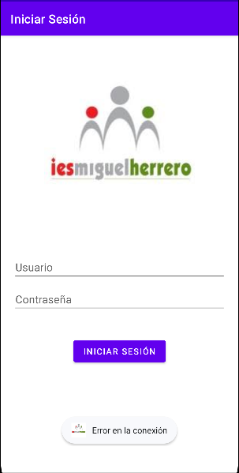
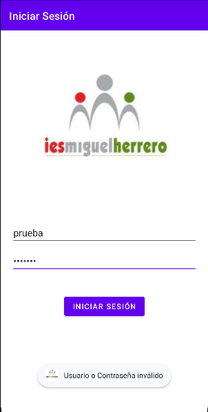
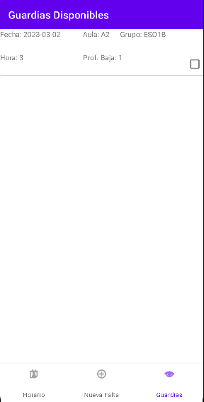
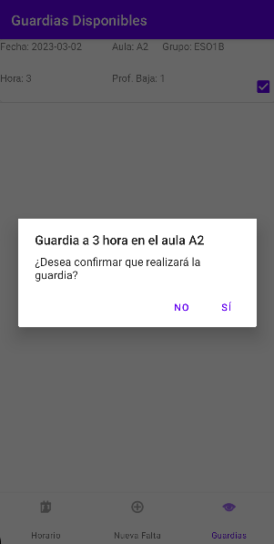
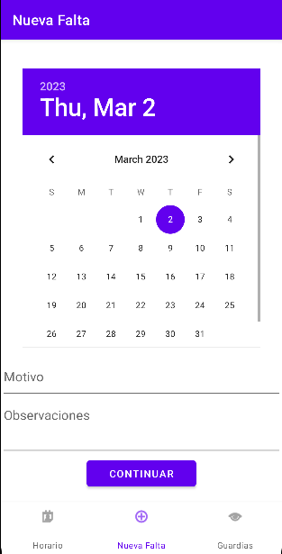
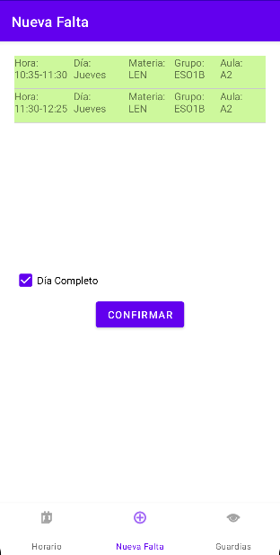
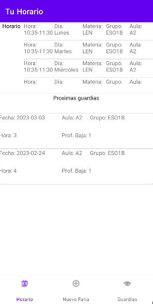
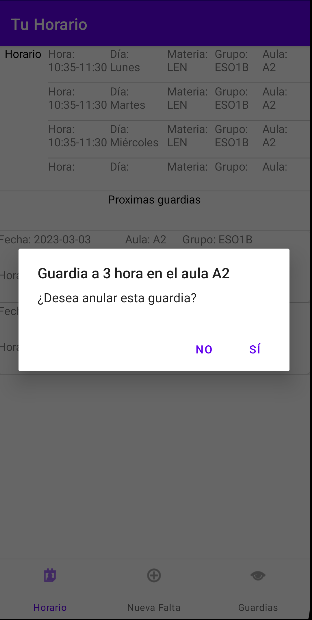

# APLICACIÓN DE FALTAS PARA MÓVIL
## **ÍNDICE**
1. [INTRODUCCIÓN](#introduccion)
2. [LOGIN](#login)
3. [VENTANAS](#ventanas)
    - [Lista de guardias](#)
    - [Generar avisos](#)
    - [Horario del profesor](#)
---
## **INTRODUCCIÓN**
Con esta aplicación instalada en sus móviles, los profesores podrán estar al tanto de todas las posibles guardias que pueda haber y que tengan la posibilidad de cubrir, además de poder avisar en cualquier momento si surgiese algún imprevisto por el que puedan faltar ellos mismos.  

---

## **LOGIN**
La ventana para iniciar sesión está formada simplemente por una imágen con el logo del centro, dos campos para introducir el nombre de usuario y la contraseña, y el botón para iniciar sesión.

### `ERRORES`  
- **FALTA DE CONEXIÓN**: Se puede dar el caso que la API en un momento puntual deje de funcionar. Eso causaría que la aplicación deje de funcionar, puesto que todos los datos que utiliza los recoge a través de la API. En un caso como este, al intentar iniciar sesión, saldrá un aviso de que ha habido un error.  

- **DATOS INCORRECTOS**: Por otro lado, aunque la API no tenga ningún problema y la aplicación pueda funcionar bien, se puede dar el caso de que el usuario introduzca datos no válidos y por lo tanto, no pueda acceder al resto de la app.  

  

### `ÉXITO`
- Si la API está funcionando correctamente, y los datos introducidos son válidos, se accede al resto de la API.  

---  

## **VENTANAS**
A continuación se mostrarán las distintas ventanas que se pueden encontrar en la aplicación.
### **Lista de guardias**
En esta ventana aparecerán, para el día actual, las guardias disponibles que pueda realizar el profesor que ha iniciado sesión.  
Esta lista podrá verse vacía en caso de que no haya guardias en el momento que cumplan los requisitos.  

  

Cada guardia tendra un *checkbox* con el que el profesor podrá indicar que realizará la guardia. Se debe tener en cuenta que, una vez aceptada la guardia, esta desaparecerá de la lista, por lo que el profesor no podrá deshacer el cambio. Le saltará un aviso antes de confirmar la realización de la guardia.  

  

### **Generar avisos**  
Este apartado constará de dos ventanas en las que el profesor podrá rellenar los datos necesarios para generar un aviso de guardia y, al mismo tiempo una guardia.  
En la primera pantalla se recogen la fecha en la que tendrá lugar la guardia, el motivo de la falta y alguna observación.  

  

Tanto el motivo como las observaciones pueden quedarse sin rellenar, mientras que la fecha, aunque no seleccione otra distinta, estará por defecto la fecha del día actual.  

Al seleccionar el botón de continuar, se pasa a la ventana para elegir el horario de la falta. La aplicación ofrecerá una lista de todas las horas que tendría el profesor según el día seleccionado en la ventana anterior. Tendrá la opción de seleccionar una, varias o todas las horas.    

*Las horas seleccionadas se marcarán en verde claro.*  
*El botón confirmar permanecerá deshabilitado hasta seleccionar mínimo una hora.*

  

En el momento en que se pulsa el botón confirmar, se generarán el aviso y la guardia correspondiente, y la aplicación llevará de vuelta a la ventana anterior por si se quiere crear otro aviso de guardia.  

También se debe señalar que, si se seleccionan más de una hora, se crearán tantos avisos con su guardia como horas estén seleccionadas.

### **Horario del profesor**  
En esta última ventana podremos encontrar dos partes. La parte superior tendrá una lista con las horas de clase que tiene el profesor. En caso de que no tenga horas, por ejemplo si se trata de alguien de la administración, el listado aparecerá vacío.  

En la parte inferior, habrá un listado de las guardias que el profesor ha generado y aún no están marcadas como realizadas ni han sido anuladas. Al igual que antes, este listado aparecerá vacío si el profesor aún no ha creado ninguna guardia o las que haya creado estén anuladas o realizadas.  

A través de este listado, el profesor podrá anular sus guardias en caso que considere que no es necesario mantener la guardia como confirmada, si se ha equivocado al crearla o que al final no faltará dicho día.  

También, igual que con las guardias del [primer listado](#lista-de-guardias), una vez se anule, desaparecerá de la lista, por lo que esa acción no será posible de revertir por el profesor. Volverá a aparecer un aviso para confirmar la anulación.  

